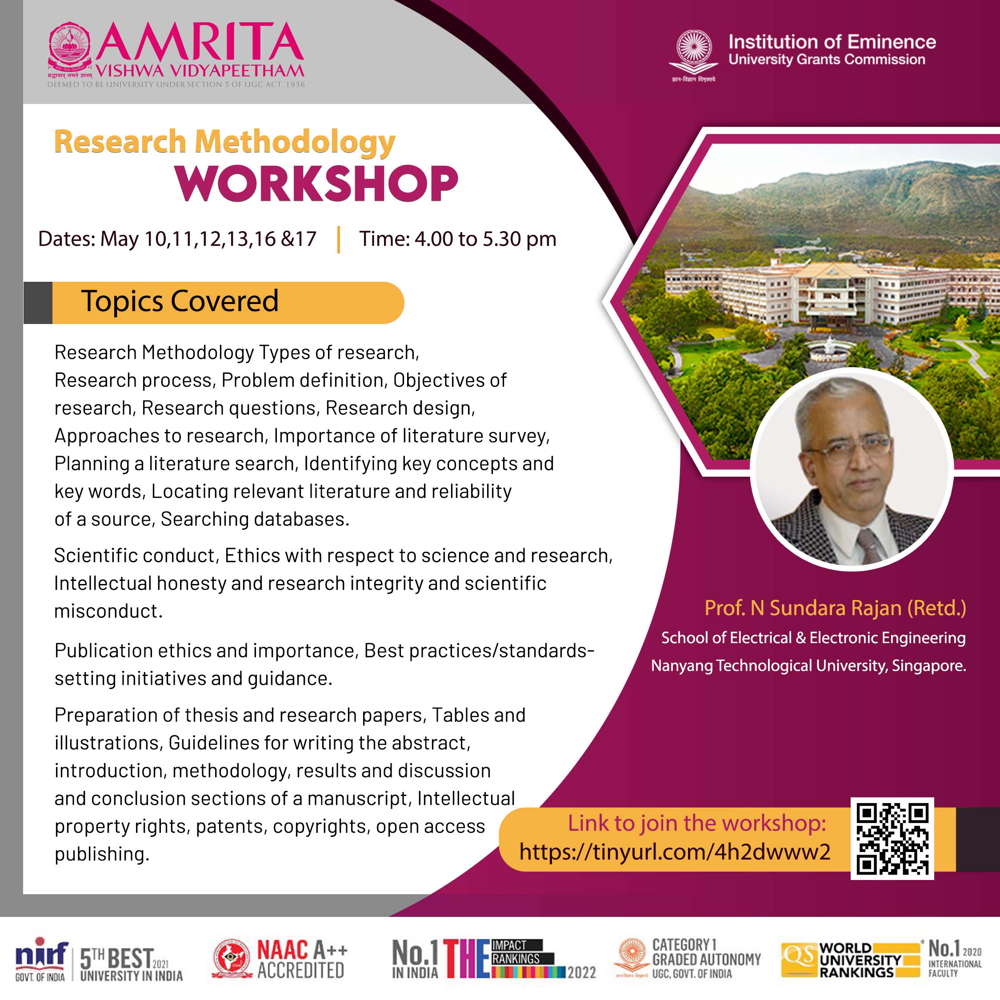

# Research Methodology 

Research Methodology Workshop by [Prof. N. Sundara Rajan]()

  

  

## Resources

#### **Day 1 - 10th May, 2022**
- [Recording](https://amritavishwavidyapeetham-my.sharepoint.com/:v:/r/personal/r_ramaguru_cb_amrita_edu/Documents/Recordings/Research%20Methodology%20sessions%20by%20Prof.%20N.%20Sundararajan_20220510_103404.mp4?csf=1&web=1&e=OXcHRx)

#### **Day 2 - 11th May, 2022**
- [Recording](https://amritavishwavidyapeetham-my.sharepoint.com/:v:/g/personal/n_prabhu_cb_students_amrita_edu/EVdRETujUV1IjrhqRypNPj4BeIxoMH-fGI9_4C9qH7fuWw)

#### **Day 3 - 12th May, 2022**
- [Recording](https://amritavishwavidyapeetham-my.sharepoint.com/:v:/g/personal/v_bharathkumar_cb_students_amrita_edu/EfnR-iWh0jROplaOidqZ2UcBxfgPPrA7_TOWnTs0XL4K9A)

#### Additional Reading
- [Authorship: why not just toss a coin](Assets/External/Authorship_why_not_just_toss_a_coin.pdf)
- [Some Modest Advice For Graduate Students](Assets/External/Some_Modest_Advice_For_Graduate_Students.pdf)
- [You and Your Research](Assets/External/You_and_Your_Research.pdf)
